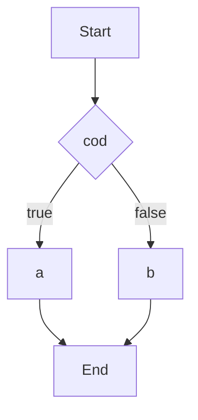
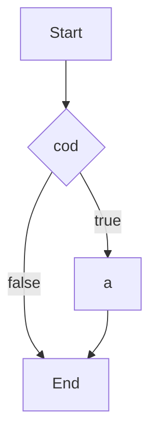
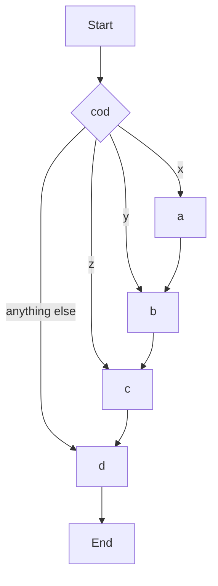
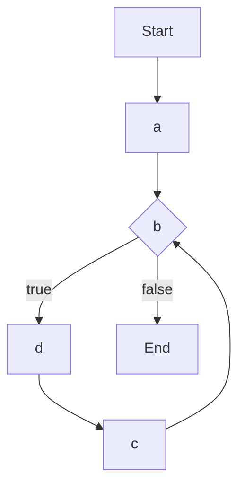
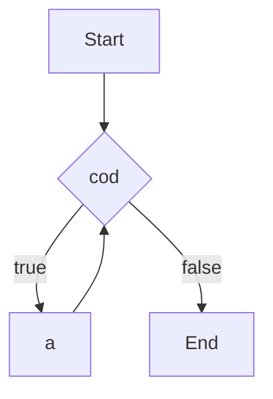
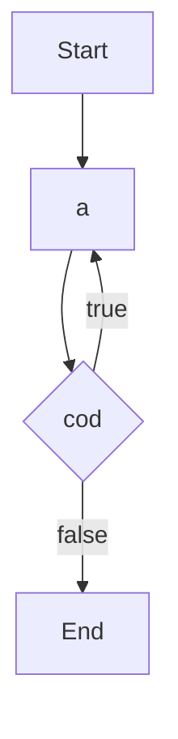

# 流程控制语句

下面我们讲两类流程控制语句：**选择分支**和**循环**。

## 选择分支

```c
if (cod)
    a;
else
    b;
```

或

```c
if (cod)
    a;
```

它的含义是这样：若 `cod` 为真，则执行语句 `a`，否则执行 `b`。若 `b` 为空，则 `else` 也可略去不写。



或



格式中的 `a`和`b` 不仅代表一条语句，也代表由大括号括起来的一个语句块。我们用选择语句来写一个阶越函数：

```c
int ret;
if (x>0) {
    ret=1;
} else {
    ret=0;
}
```

不过这个阶越函数写的并不正确，当 x 等于 0 时函数应该是没有值的。在 C 语言里我们就让变量等于 `NaN`，它的含义是 Not a Number。那么要如何实现三个分支呢，很简单，只要在 if ... else 里再套一个 if ... else 就行了。

```c
if (x>0) {
    ret=1;
} else {
    if (x<0) {
        ret=0;
    } else {
    	ret=NaN;
    }
}
```

习惯上我们会把嵌套 if ... else ... 写成这样：

```c
if (x>0) {
    ret=1;
} else if (x<0) {
    ret=0;
} else {
    ret=NaN;
}
```

上面代码中的大括号都可以略去不写。另外，如果两个 if 底下只跟了一个 else，若产生歧义，这个 else 先与离它最近的 if 配对。

还有一种分支选择语句是这样的：

```c
switch (cod) {
case x:
	a;
case y:
	b;
case z:
	c;
default:
	d;
}
```

它的含义是：若 cod 的值等于 x，则开使执行语句 a，然后继续执行 b, c, d；若为 y 则从 b 开始执行；若都不满足则只执行 d。



a, b, c, d 表示一条或多条语句，不需要用大括号括起来。case 可以有任意多个，default 不是必须的。

case 和 default 都是 C 语言中的「保留字」。`case x:` 和 `default:` 叫做「语句标号」，除了这两条我们也可以像给变量起名字一样自己添加语句标号，它标记了代码中的一个位置。自己添加的语句标号也属于标识符，要符合规则。

case 后面跟的必须是整数类型常量。

```c
switch (molecule_type) {
case 0:
	internal_energy=3*mol_v*const_R*temp/2;
    break;
case 1:
	internal_energy=5*mol_v*const_R*temp/2;
    break;
case 2:
	internal_energy=3*mol_v*const_R*temp;
    break;
default:
	internal_energy=NaN;
}
```

break 是 C 语言的保留字，出现在 switch 分支选择内时表示立即跳出 switch 大括号。使用 break 可以实现多个分支的选择，类似上面的嵌套 if ... else 。

## 循环

```c
for (a;b;c)
    d;
```

它的含义是：先执行语句 a，然后，若 b 为真，执行 d，然后执行 c，再去判断 b，如此循环。和上面的选择分支一样，d 也可以代表由大括号括起来的一个语句块。另外，a, b, c 可以为空。



```c
while (cod)
    a;
```





```c
do {
    a;
} while (cod);
```




while 循环很容易理解，只要条件为真，就执行循环体。do ... while 与 while 的区别在于 do ... while 先执行一遍循环体，再去判断条件。

下面我们用两种循环语句来实现阶乘：

```c
int k=10;
int ret=1;
for (int i=k;i>1;i--) {
    ret*=i;
}
```

```c
int k=10;
int ret=1;
int i=k;
while (i>1) {
    ret*=i;
    i--;
}
```

那么，for 循环和 while 循环是不是可以任意转换，只是写法有差别呢？似乎

```c
for (a;b;c)
    d;
```

可以直接转换成

```c
a;
while (b) {
    d;
    c;
}
```

而不产生任何差异。

其实并不是这样。首先，a 如果是一条变量初始化语句，则这个变量的作用域是不同的，「作用域」这个概念我们以后再讲；其次，如果循环体内有 continue 关键字，就有表达式 c 执行与否的区别。我们来看下面的问题。

给定奇数 a，求 1+3+...+a。

```c
int a;
// assign a value somehow
int s=0;
for (int i=a;i>0;i--) {
    if (!(i&1)) continue;
    s+=i;
}
```

`!(i&1)` 是判断 i 是否为偶数，continue 关键字表示立即结束当前循环，直接开始下一次循环。当然这里可以把 `i--` 写成 `i-=2` 来避免奇偶判断，不过这里为了演示 continue，就让 i 每次减少 1，然后去判断奇偶性。

若把上面的 for 循环直接改成 while 循环，就会变成这样：

```c
int a;
// assign a value somehow
int s=0;
int i=a;
while (i>0) {
    if (!(i&1)) continue;
    s+=i;
    i--;
}
```

当 i 取到 a-1 时它是一个偶数，程序就会永远陷在 while 循环里出不来，因为 `i--` 不会被执行到，i 的值就不会改变。程序陷在循环语句内出不来的情况，我们称之为「死循环」。

一般来说，for 循环适合用在循环体执行次数固定的场合，while 适合循环体执行次数不固定的场合。