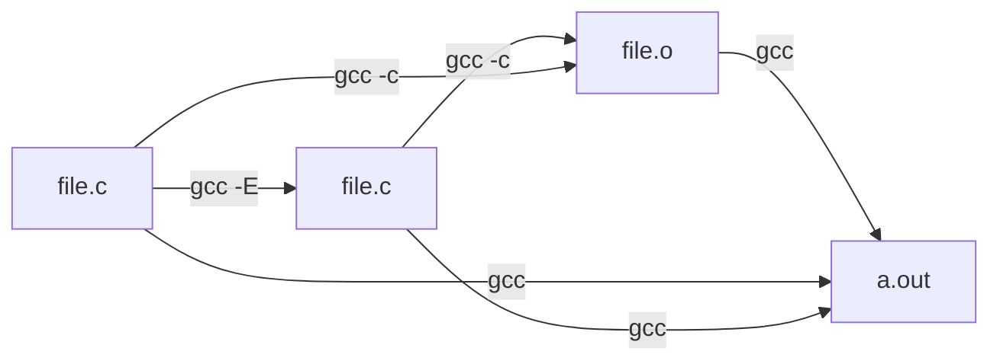

# 编译预处理

C 语言源代码在编译之前还要做一步操作，叫做编译预处理 (cpp)。这一步会做宏替换、引入头文件、根据环境对源代码做一些特定处理。以 "#" 开头的一行都属于编译预处理操作，"#" 连带后的第一个词叫做编译预处理指令。



gcc 的编译预处理手册可以在 gnu 官网上找到。(https://gcc.gnu.org/onlinedocs/ 2020-11-13)

```c
#include <stdio.h>
```

`#include` 就是一个常见编译预处理指令，它表示向源代码引入头文件 `stdio.h`。但我们并没有在当前目录下看到一个叫做 `stdio.h` 的文件，那么这个文件在哪里呢？它位于 `/usr/include/`。至于文件的内容，我们暂时不去关心。

从头文件的名字上我们可以看出，这是和标准输入输出有关的文件。引入这个文件之后，我们就可以使用标准库提供的输入和输出的相关函数，做一些基本的交互了。